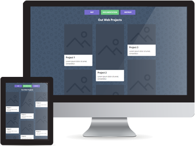

# Pinto - jQuery Responsive Grid Layout

### ABOUT

Pinto.js is a customizable jQuery plugin for creating a pinterest like responsive grid layout.

Advantages:
- Super simple to install
- Fast execution and lightweight code
- You can change the settings



## Documentation

It just take seconds to install and use pinto.js.

- [Read the documentation](http://avirtum.com/item/36/pinto-jquery-responsive-grid-layout-plugin/)
- [See the demo](http://avirtum.com/preview/?item=pinto)

### Installation

- Bower

```bash
   bower install pinto
```

### Basic usage

- HTML

```html
    <div id="container">
        <div class="pinto"><div class="info"><h2>Project 1</h2></div></div>
        <div class="pinto"><div class="info"><h2>Project 2</h2></div></div>
        <div class="pinto"><div class="info"><h2>Project 3</h2></div></div>
    </div>
```

- JavaScript

```javascript
$("#container").pinto();
```


### LICENSE

Released under the [MIT License](http://www.opensource.org/licenses/mit-license.php)